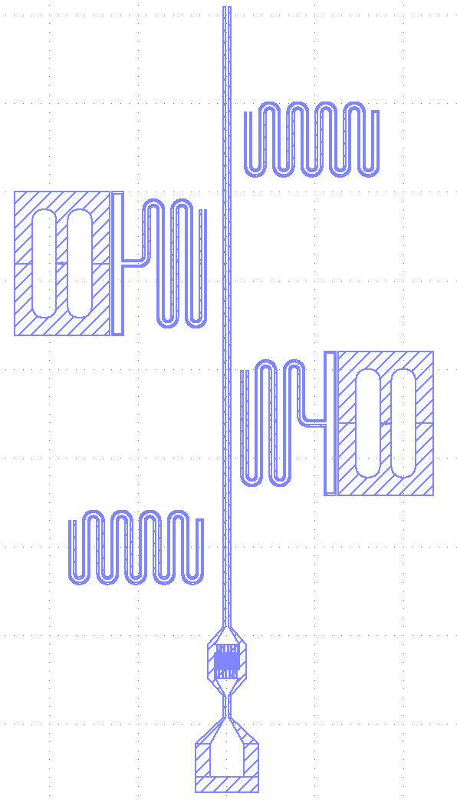
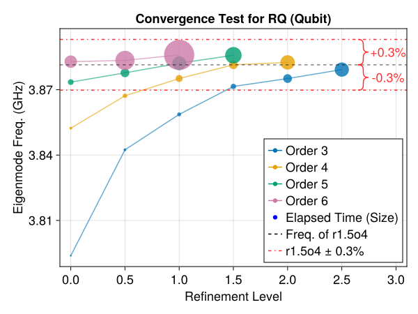
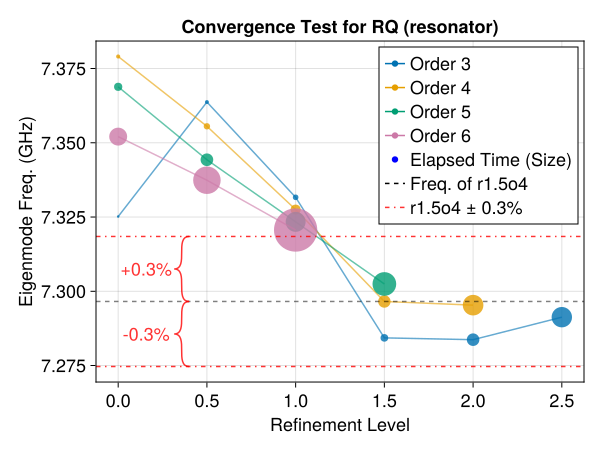
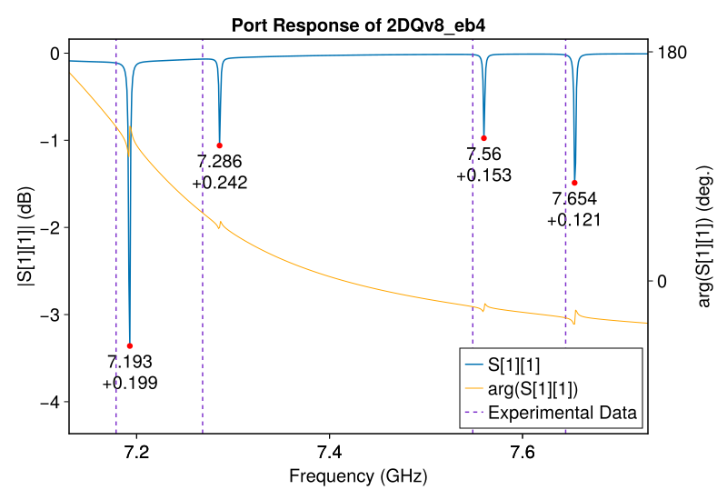
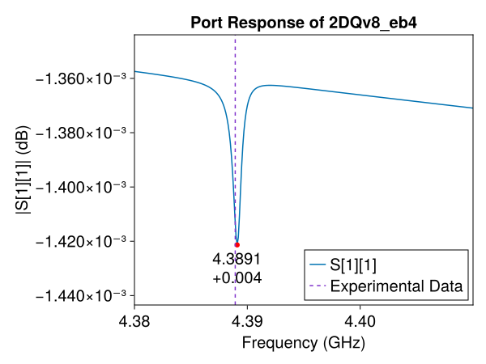

# PalaceForCQED

EM simulations workflow scripts for superconducting quantum circuits using [awslabs/palace](https://github.com/awslabs/palace).

## Example



### Running Simulations

```bash
cd PalaceForCQED
julia --project=. examples/run.jl
```

### Convergence Test

See `examples/convergence.jl` and `examples/convergence_plot.py` for details.





### Port Response

See `examples/driven.jl` and `examples/driven_plot.py` for details.




### Lj Sweep

See `examples/sweep_Lj.jl` and `examples/sweep_Lj_plot.py` for details.